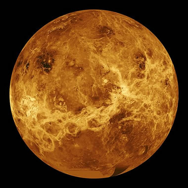

## I. INTRODUCTION   

It is well known that Venus is the closest planet to Earth. However, the surface of Venus is obscured by layers of thick cloud cover. It was until NASA's Magellan spacecraft was launched off for a mission to Venus on May 4, 1989 that the first detailed information about the surface of Venus was revealed. The mission mapped surfaces of Venus and image recorded most 98% of Venus surface. Dr. King in his article *Volcanoes on Venus* has mentioned that "volcanic activity is the dominant process for shaping the landscape of Venus, with over 90% of the planet's surface being covered by lava flows and shield volcanoes". Based on the images of volcanoes on Venus, we aim to construct prediction model to identify whether an image contains volcanoes or not, and how many volcanoes are there. **Figure 1** is a simulated color image of the surface of Venus created by NASA using radar topography data acquired by the Magellan spacecraft.

```{r echo=FALSE, out.width="250px", fig.cap="Volcanoes on Venus"}

```
### Data Source Information
The data was downloaded from Kaggle, which is originally from NASA's Magellan spacecraft database. (https://www.kaggle.com/amantheroot/finding-volcanoes-on-venus/data)

### Data Description
9734 images were captured by the NASA's Magellan spacecraft in the 1990s and converted to pixels (110 x 110, from 0 to 255), where each image is one row of 12100 columns (all the 110 rows of 110 columns). Images can contain more than one volcanoes or maybe none.
The 9000+ images are separated to four datasets (file names : *train_images*, *train_labels*, *test_images*, and *test_labels*):

#### Image Dataset (*train_images* and *test_images*)
*Train_images* : 7000 images as train data with 12100 variables;  
*Test_images* : 2734 images as test data with 12100 variables; 
All the variables (V1 to V12100) correspond to the pixel image, 110 pixels * 110 pixels = 12100 pixels.

#### Label Dataset (*train_labels* and *test_labels*)
A summary of the variables in both *train_labels* and *test_label* datasets is listed down below:   
1. *Volcano?* : If in the image there exists at least one volcano, the label is 1 (Yes). Otherwise, the label is 0 (No). 
(If Volcano? equals 0, the following three categories would be "NaN").
2. *Type* : 1 = definitely a volcano,2 = probably, 3 = possibly, 4 = only a pit is visible   
3. *Radius* : Is the radius of the volcano in the center of the image, in pixels?   
4. *Number Volcanoes* : The number of volcanoes in the image.  

### Literature Review
Scientific papers regarding images obtained throught the Magellan mission were published, including Berl etc in 1989. In the 1989 paper, machine learning approach was introduced to facilitate in recognizing volcanoes from the images obtained in the mission. 
It was mentioned that in image data, volcanoes could appear in any pixel location, therefore principal components analysis (PCA) and linear discriminant analysis (LDA) could be implemented in feature extraction. Various training algorithms such as quadratic classifiers, decision trees, linear discriminant analysis, and nearest neighbors were used and produced similar outcomes. 

These venus datasets were uploaded in Kaggle and 11 kernels regarding this data analysis were produced, all using Python. The kernels included vivid data visualization and exploratory data. Most kernels focused on classification prediction on whether there are volcanoes or not. For this classification prediction, different methods have been used to construct prediction model, from simple models such as logistic regression, to advanced models such as Convolutional Neural Network (CNN) and VGG Neural Network for deep learning. Accuracy of models ranged from 84.1% to 97%.

### Scientific Goal
For this project, we focus mainly on doing classification predition on whether each image has a volcano or not.  We aim in constructing different classification models and choosing the best model to predict whether there exists a valcano in each image. Identifying valcanoe through IT technology would increase the efficency of space exploration and safty of the crews.  In addition, we also constructed a few models to perform prediction on the number of volcanoes in the images. 

## II. EXPLORATORY DATA

```{r include=FALSE}
#################
# load datasets #
#################
load("test_data.RData")
load("train_data.Rdata")
train_y <- read.csv("train_labels.csv", header = TRUE)
test_y <- read.csv("test_labels.csv", header = TRUE)
```

The first 6 observations of *train_labels*
```{r head_train_y, echo=FALSE}
head(train_y)
```
\newpage
The first 6 observations of *test_labels*
```{r head_test_y, echo=FALSE}
head(test_y)
```

After exploring the datasets, we found only labels have NaNs. The NaNs in the label dataset occurs only when there is no Volcanoe in the image observation, then `Type`, `Radius` and `Number.Volcanoes` would be NaNs as there are no volcanoes. We have set the all these NaNs to 0.

```{r include=FALSE}
test_y[is.na(test_y$Type), ] <- 0
test_y[is.na(test_y$Radius), ] <- 0
train_y[is.na(train_y$Type), ] <- 0
train_y[is.na(train_y$Radius), ] <- 0
```

### Data Visualization

6 observations are picked to demonstrate how the images got labeled. **Figure 2 - 5** show how well the volcanoes can be seen from the images (*Type* : 1 = definitely a volcano,2 = probably, 3 = possibly, 4 = only a pit is visible). **Figure 6** contains 2 volcanoes, and Figure 6 contains no volcano at all. We can tell from the images that a bright white dot indicates a potential volcano, while the white dot might not be clear enough to see in the image, which means that it is hard to identify whether there is a volcano or not.

```{r volplot_function, echo=FALSE, fig.height=5, fig.width=5}
volplot <- function(data, obs){
  im <- as.numeric(data[obs,])
  m <- matrix(im, nrow = 110, byrow = TRUE)
  image(m, col = grey((0:255)/255))
}
```

```{r, echo=FALSE, fig.height=2.5, fig.width=2.5, fig.cap="Obs 10 Type: 1 Radius: 22.02 Number Volcanoes: 1"}
volplot(train_data, 10)
```

```{r, echo=FALSE, fig.height=2.5, fig.width=2.5, fig.cap="Obs 39 Type: 2 Radius: 19.31 Number Volcanoes: 1"}
volplot(train_data, 39)
```

```{r, echo=FALSE, fig.height=2.5, fig.width=2.5, fig.cap="Obs 1 Type: 3 Radius: 17.46 Number of Volcanoes: 1", fig.pos='H'}
volplot(train_data, 1)
```

```{r, echo=FALSE, fig.height=2.5, fig.width=2.5, fig.cap="Obs 30 Type: 4 Radius: 6.40 Number Volcanoes: 1", fig.pos='H'}
volplot(train_data, 30)
```

```{r, echo=FALSE, fig.height=2.5, fig.width=2.5, fig.cap="Obs 289 Type: 1 Radius: 11.05 Number Volcanoes: 2", fig.pos='H'}
volplot(train_data, 289)
```

```{r, echo=FALSE, fig.height=2.5, fig.width=2.5, fig.cap="Obs 2 No Volcano", fig.pos='H'}
volplot(train_data, 2)
```

### Data Summary

To facilitate the analysis process and explore the data, we have summarized the data. The `ggplot` has been used to visualize the training set labels. **Figure 8** shows that only 1000 images in the training dataset have volcanoes. **Figure 9** shows that within 1000 images that have volcanoes, how clearly we can identify the volcanoes. **Figure 10** shows how many volcanoes there are in each image. The number of volcanoes ranges from 0 to 5.

```{r echo=FALSE, message=FALSE, warning=FALSE, fig.height=3, fig.width=3, fig.cap="How many images have volcanoes?", fig.pos='H'}
library(ggplot2)
train_y$Volcano. <- as.factor(train_y$Volcano.)
levels(train_y$Volcano.) <- c("No", "Yes")
ggplot(train_y, aes(x = Volcano., fill = Volcano.)) +
  geom_bar(stat='count') +
  labs(x = 'How many images have volcanoes?') +
        geom_label(stat='count',aes(label=..count..), size=2) +
        theme_grey(base_size = 8) +
        theme(legend.position="bottom")
```

```{r echo=FALSE, fig.height=3, fig.width=3, fig.cap="How clealy can we identify the volcanoes?", fig.pos='H'}
train_y$Type <- as.factor(train_y$Type)
levels(train_y$Type) <- c("no volcano", "definitely a volcano", "probably", "possibly", "only a pit is visible")
ggplot(train_y[(train_y$Type != "no volcano"),], aes(x = Type, fill = Type)) +
  geom_bar(stat='count') +
  labs(x = 'How clearly can we identify the volcanoes?') +
        geom_label(stat='count',aes(label=..count..), size=2) +
        theme_grey(base_size = 8) +
        theme(legend.position="bottom")
```

```{r echo=FALSE, fig.height=3, fig.width=3, fig.cap="How many volcanoes are there in each image?", fig.pos='H'}
train_y$Number.Volcanoes <- as.factor(train_y$Number.Volcanoes)
ggplot(train_y[(train_y$Number.Volcanoes != "0"),], aes(x = Number.Volcanoes, fill = Number.Volcanoes)) +
  geom_bar(stat='count') +
  labs(x = 'How many volcanoes in each image?') +
        geom_label(stat='count',aes(label=..count..), size=2) +
        theme_grey(base_size = 8) +
        theme(legend.position="bottom")
```
## III. METHODOLOGY & ANALYSIS

As the project data is image data, preprocessing was not neccessary to fit model. For the prediction of whether there is volcanoe or not, we constructed simple prediction models and advanced models, as discussed as following. For evaluation metric for these models, as references has indicated that uncertainty exists in the identification of volcanoes in the images. We used AUC (Area under the ROC, receiver operating characteristic) and F1 score. As AUC and F1 score provides overall performance measure of classifcation, it incorportates the uncertainty of the predictions.  For the prediction of how many volcanoes there is, root mean square error (RMSE) was used logistic, lasso, and xgboost and AUC was used for neural network. Models used for the two kinds of prediction are summarized as the following table.

\begin{center}
\begin{tabular}{cccll}
\cline{1-3}
\multicolumn{1}{|c|}{\textbf{Model}} & \multicolumn{1}{c|}{\textbf{Predict if have volcanoe}} & \multicolumn{1}{c|}{\textbf{Predict How many volcanoes}} \\ 
\cline{1-3}
\multicolumn{1}{|c|}{\textbf{Neural Network}}  & \multicolumn{1}{c|}{V} & \multicolumn{1}{c|}{V}\\ 
\cline{1-3}
\multicolumn{1}{|c|}{\textbf{xgboost}} & \multicolumn{1}{c|}{V} & \multicolumn{1}{c|}{V} \\ 
\cline{1-3}
\multicolumn{1}{|c|}{\textbf{Lasso}} & \multicolumn{1}{c|}{V} & \multicolumn{1}{c|}{V} \\ 
\cline{1-3}
\multicolumn{1}{|c|}{\textbf{Random Forest}} & \multicolumn{1}{c|}{V} & \multicolumn{1}{c|}{ } \\ 
\cline{1-3}
\multicolumn{1}{|c|}{\textbf{Logistic (Marginal Screening)}} & \multicolumn{1}{c|}{V} & \multicolumn{1}{c|}{V} \\ 
\cline{1-3}
\multicolumn{1}{|c|}{\textbf{Logistic (Lasso Selection)}} & \multicolumn{1}{c|}{V} & \multicolumn{1}{c|}{V} \\ 
\cline{1-3}
\multicolumn{1}{|c|}{\textbf{Linear Discriminant Analysis}} & \multicolumn{1}{c|}{V} & \multicolumn{1}{c|}{ } \\ 
\cline{1-3}
\end{tabular}
\end{center}

Prior to using supervised learning methods, we applied kmeans clustering to the train dataset to see whether the pixels could accurately cluster the training dataset into 2 clusters. We used `kmeans` function with 2 centers and 20 random sets. The confusion matrix of the clusering result are as following, it can be seen that by simply clustering the pixels, it is difficult to cluster the observations into 2 groups.  

\begin{center}
\begin{tabular}{cccll}
\cline{1-3}
\multicolumn{1}{|c|}{Cluster / Label} & \multicolumn{1}{c|}{\textbf{0}} & \multicolumn{1}{c|}{\textbf{1}} \\ \cline{1-3}
\multicolumn{1}{|c|}{\textbf{1}}  & \multicolumn{1}{c|}{5810}        & \multicolumn{1}{c|}{999}           \\ \cline{1-3}
\multicolumn{1}{|c|}{\textbf{2}} & \multicolumn{1}{c|}{190}          & \multicolumn{1}{c|}{1}          \\ \cline{1-3}
\end{tabular}
\end{center}

### Linear Dicriminant Analysis (LDA) and Quadratic Discriminant Analysis (QDA)

Linear Dicriminant Analysis was applied by using `MASS` package. Prediction using LDA analysis produced adequate results, however, it output warning of 'variables are collinear'. Implementing QDA analysis produced error of 'some group is too small for qda'. The warning and error produced may be that our parameter (pixel) number is too large. Therefore to solve this problem, we try to use other algorithms to fit the dataset.  

### Lasso Regression  

Lasso regression was applied as it can perform variable selection, which is suitable in the project situation : having more parameters than observations. To apply Lasso Regression,`glmnet` package was implemented. We first selected reasonable interval for tuning parameter $\lambda$ by examing cross-validation error. After that, we did the model selection by using glmnet and use the "lambda.min" as final tuning parameter.  

We ran two Lasso Regressions. One for classification: whether there is a volcanoe or not; one for Poisson distribution: how many volcanoes are there. By using the cross-validation error data, we identified two intervals, (-6.5, -5) and (-5, -4.5). Because of the different interval, we have different selected variable numbers: 470 and 114. The prediction using those pixels yielded a good start, a high prediction accuracy.

### Logistic Regression

Two Logistic Regressions were applied for classification and Poisson prediction. Before performing logistic regression, we used two variable selection methods to reduce dimension. 400 and 250 pixels were selected by using Marginal Screening, respectively; 470 and 114 pixels were selected by using above Lasso Regression. Then, we applyed logistic regressions on those 4 sets of selected pixels repectively. We then recorded their F1 score and AUC for classification, and RMSE for Poisson prediction.  

### Neural Network  

Convolutional neural networks (CNNs) have been applied widely in image and video recognition and classification. CNNs are made up of neurons with learnable weights and bias. Therefore, CNNs were used in the project for seeking better classfication results. Some pooling layers were added into the models to progressively reduce the spatial size and the amount of parameters and computation in the network. The raw data *train_images* and *test_images* was converted into numeric variables and reshaped into 3D array with dimension 7000 $\times$ 110 $\times$ 110 and 2734 $\times$ 110 $\times$ 110 respectively. The pixels were shrinked from 0-255 to 0-1 by dividing each pixel by 255. The target label (Volcano?) was converted into categorical variable for classification. The neural network models yielded efficient and satisfying classification results. The loss function is relatively low, indicating the models are good.

Two neural network models were run in this project. **Figure 11** shows the result of the first neural network model which is designed to classify whether an image contains a volcano. The model used 20% of the training data as validation data. **Figure 12** shows the result of the second neural network model which is designed to classify whether an image contains at least one volcano. The model, similar to the first one, used 20% of the training data as validation data. 

```{r echo=FALSE, out.width="250px", fig.cap="Neural Network to classify whether an image contains volcanoes", fig.pos='H'}
knitr::include_graphics("neural_network.png")
```

The loss function and accuracy:
```{r echo=FALSE}
load("neural_network.RData")
acc_loss
```

```{r echo=FALSE, out.width="250px", fig.cap="Neural Network to classify how many volcanoes in each image", fig.pos='H'}
knitr::include_graphics("neural_network_number.png")
```

The loss function and accuracy:
```{r echo=FALSE}
load("neural_network_number.RData")
acc_loss_number
```

```{r eval=FALSE, include=FALSE}
library(MLmetrics)
library(pROC)
table(pred_results_class, test_y$Volcano.)
F1_Score(y_true = test_y[,1], y_pred = pred_results_class, positive = NULL)
auc(test_y[,1], pred_results[,2])
plot(auc(test_y[,1], pred_results[,2]))
ROC_nn <- roc(test_y[,1], pred_results[,2])
plot(ROC_nn)

table(pred_results_number_class, test_y$Number.Volcanoes)
F1_Score(y_true = test_y[, 4], y_pred = pred_results_number_class, positive = NULL)
```

### Random Forest  
Random Forest was implemented using the `randomForest` package. Originally, n.tree was set to 200 and all other parameters were set as default. However, due to our large parameter and observation number, this took over than 10 hours to run. As it took too much time, it was terminated before it finished running. The final model used in this project was by setting n.tree to 200, mtry to 80 and nodesize to 70. Variable importance were recorded to compare with variable selection in other methods. Variable importance from random forest are shown in **Figure 13**. The yellow represents the important ones while black means those pixels are less meaningful for our prediction.

```{r echo=FALSE, out.width="250px", fig.cap="The Random Forest variable importance heatmap", fig.pos='H'}
knitr::include_graphics("rf_heatmap.png")
```

### Xgboost

As xgboost is nowadays a popular algorithm used in machine learning and Kaggle competitions, this algorithm was also used in this project to see its performance. Xgboost was implemented using the `xgboost` package. Tuning was performed by using `xgb.cv` function with nfold = 5, parameters that were tuned are eta (learning rate), max_depth (maximum depth of a tree), min_child_weight (minimum sum of instance weight needed in a child), subsample (subsample ratio of the training instance), colsample_bytree (subsample ratio of columns when constructing each tree). The tuning process took over 12 hours and was terminated before it finished all the combinations. The parameter combination with the lowest error was used. From the tuning process, parameterts used for this model are set as following: eta = 0.1,  max_depth = 5,  min_child_weight =5,  subsample = 0.65, colsample_bytree = 0.8, nrounds = 200,  objective = 'binary:logistic'. To model how many volcanoes there are, objective = 'count:possion' was used with same parameters as before.


### Variable selection methods

#### Shrinking method (Lasso)

By applying Lasso Regression, we were able to shrink highly correlated pixels to 0 and only had important ones left. With the tuning parameter $\lambda$'s interval we selected by examing the cross validation result, we selected 470 important pixels for classification, 250 pixels for Poisson prediction, and apply those to lasso and logistic regression respectively.

#### Marginal Screening

To apply Marginal Screening, we use for loop to model each pixels with outcome by using glm function, logistic regression. After sorting the p values from smallest to largest, we selected the top 400 pixels for classification and 250 for poisson prediction. The reason why we select top 400 and 250 pixels is that, after trying different number of top pixels, we found 400 pixels gave us highest prediction accuracy. 

#### Variable selection methods comparison

We originally only applied Marginal Screening to logistic regression. But after realizing Lasso helped us selected variables as well, we tried both methods on logistic regression.

By looking at the pixels' index, **figure 14** and **figure 16**, we found that the pixels selected by Marginal Screening focused between 4000-7000 for classification and between 5200 - 7000 for poisson prediction, which corresponds to the center of pictures; while pixels selected by lasso regression were more spread, as shown in **figure 15** and **figure 17**. Comparing these variable selection results to the variable importance in random forest, it is noted that trend of selected variables in Lasso corresponds to the variable importance in random forest.

By applying those two different selection methods, we found the accuracy of Lasso selection is higher for classification; while for Poisson prediction, Marginal Screening selection performs better.

```{r echo=FALSE, out.width="250px", fig.cap="The Marginal Screening index for classification", fig.pos='H'}
knitr::include_graphics("M_C.png")
```
```{r echo=FALSE, out.width="250px", fig.cap="The Lasso index for classification", fig.pos='H'}
knitr::include_graphics("Lasso_C.png")
```
```{r echo=FALSE, out.width="250px", fig.cap="The Marginal Screening index for Poisson prediction", fig.pos='H'}
knitr::include_graphics("M_p.png")
```
```{r echo=FALSE, out.width="250px", fig.cap="The Lasso index for Poisson prediction", fig.pos='H'}
knitr::include_graphics("lasso_P.png")
```
```{r echo=FALSE, out.width="250px", fig.cap="Variable Importance in Random Forest", fig.pos='H'}
knitr::include_graphics("rfimport.png")
```

Hence, for classification, lasso' more spread pixels made more sense because Marginal Screening's centered selection might ignore some important pixels at the edges. For Poisson prediction, we prefer the Marginal Screening since the smaller number of pixels selected by Lasso regression would omit some important information.

Overall, we could conclude the variable selection criteria for this project is how much information the index can tell us without overfitting model.

Our model prediction results are summarized in table below. 


\begin{center}
Table 1: Test dataset prediction result on whether there is volcanoe or not
\end{center}

\begin{center}
\begin{tabular}{cccll}
\cline{1-3}
\multicolumn{1}{|c|}{\textbf{Model}} & \multicolumn{1}{c|}{\textbf{AUC}} & \multicolumn{1}{c|}{\textbf{F1 Score}} \\ 
\cline{1-3}
\multicolumn{1}{|c|}{\textbf{Neural Network}}  & \multicolumn{1}{c|}{0.9629} & \multicolumn{1}{c|}{0.9747}\\ 
\cline{1-3}
\multicolumn{1}{|c|}{\textbf{xgboost}} & \multicolumn{1}{c|}{0.9680} & \multicolumn{1}{c|}{0.9628} \\ 
\cline{1-3}
\multicolumn{1}{|c|}{\textbf{Lasso}} & \multicolumn{1}{c|}{0.9347} & \multicolumn{1}{c|}{0.9574} \\ 
\cline{1-3}
\multicolumn{1}{|c|}{\textbf{Random Forest}} & \multicolumn{1}{c|}{0.9367} & \multicolumn{1}{c|}{0.9399} \\ 
\cline{1-3}
\multicolumn{1}{|c|}{\textbf{Logistic (Marginal Screening)}} & \multicolumn{1}{c|}{0.8429} & \multicolumn{1}{c|}{0.9386} \\ 
\cline{1-3}
\multicolumn{1}{|c|}{\textbf{Logistic (Lasso Selection)}} & \multicolumn{1}{c|}{0.8672} & \multicolumn{1}{c|}{0.9527} \\ 
\cline{1-3}
\multicolumn{1}{|c|}{\textbf{Linear Discriminant Analysis}} & \multicolumn{1}{c|}{0.8893} & \multicolumn{1}{c|}{0.9381} \\ 
\cline{1-3}
\end{tabular}
\end{center}


\begin{center}
Table 2: Test dataset prediction result on how many volcanoes there are in the images
\end{center}

\begin{center}
\begin{tabular}{cccll}
\cline{1-2}
\multicolumn{1}{|c|}{\textbf{Model}} & \multicolumn{1}{c|}{\textbf{RMSE}} \\ 
\cline{1-2}
\multicolumn{1}{|c|}{\textbf{Logistic}}  & \multicolumn{1}{c|}{0.5073} \\ 
\cline{1-2}
\multicolumn{1}{|c|}{\textbf{xgboost}} & \multicolumn{1}{c|}{0.0613} \\ 
\cline{1-2}
\multicolumn{1}{|c|}{\textbf{Lasso}} & \multicolumn{1}{c|}{0.4613} \\ 
\cline{1-2}
\end{tabular}
\end{center}


Neural Network

Since neural network models yielded the best results, we have concluded the classification table down below. 

\begin{center}
Table 3: Classification results using neural network for identifying volcanoes in the images
\end{center}

\begin{center}
\begin{tabular}{cccll}
\cline{1-3}
\multicolumn{1}{|c|}{}             & \multicolumn{1}{c|}{\textbf{No}} & \multicolumn{1}{c|}{\textbf{Yes}} \\ \cline{1-3}
\multicolumn{1}{|c|}{\textbf{No}}  & \multicolumn{1}{c|}{2270}        & \multicolumn{1}{c|}{88}           \\ \cline{1-3}
\multicolumn{1}{|c|}{\textbf{Yes}} & \multicolumn{1}{c|}{30}          & \multicolumn{1}{c|}{346}          \\ \cline{1-3}
\end{tabular}
\end{center}

\begin{center}
Table 4: Classification results using neural network for identifying the number of volcanoes in the images
\end{center}

\begin{center}
\begin{tabular}{cccll}
\cline{1-5}
\multicolumn{1}{|c|}{} & \multicolumn{1}{c|}{\textbf{0}} & \multicolumn{1}{c|}{\textbf{1}} & \multicolumn{1}{c|}{\textbf{2}} & \multicolumn{1}{c|}{\textbf{3}} \\ 
\cline{1-5}
\multicolumn{1}{|c|}{\textbf{0}}  & \multicolumn{1}{c|}{2272} & \multicolumn{1}{c|}{67} & \multicolumn{1}{c|}{15} & \multicolumn{1}{c|}{2}\\ 
\cline{1-5}
\multicolumn{1}{|c|}{\textbf{1}} & \multicolumn{1}{c|}{23} & \multicolumn{1}{c|}{266} & \multicolumn{1}{c|}{44} & \multicolumn{1}{c|}{7} \\ 
\cline{1-5} 
\multicolumn{1}{|c|}{\textbf{2}} & \multicolumn{1}{c|}{5} & \multicolumn{1}{c|}{26} & \multicolumn{1}{c|}{4} & \multicolumn{1}{c|}{3} \\ 
\cline{1-5}

\end{tabular}
\end{center}


## IV. CONCLUSION & DISCUSSION  

\begin{center}
Table 5: Classification results using xgoost for identifying volcanoes in the images
\end{center}

\begin{center}
\begin{tabular}{cccll}
\cline{1-3}
\multicolumn{1}{|c|}{}             & \multicolumn{1}{c|}{\textbf{No}} & \multicolumn{1}{c|}{\textbf{Yes}} \\ \cline{1-3}
\multicolumn{1}{|c|}{\textbf{No}}  & \multicolumn{1}{c|}{2280}        & \multicolumn{1}{c|}{156}           \\ \cline{1-3}
\multicolumn{1}{|c|}{\textbf{Yes}} & \multicolumn{1}{c|}{20}          & \multicolumn{1}{c|}{278}          \\ \cline{1-3}
\end{tabular}
\end{center}

Machine learning methods have long been popular in aiming at establishing models to faciliate humans in retreiving information from large datasets. One of the discussion topics in the venus image data, obtained through NASA's Magellan spacecraft, is identifying whether there are volcanoes or not, how many there are, and the confidence people have in identifying they are volcanoes. For our project, we aim in establishing prediction models in predicting the existance of volcanoe in image data as well as establishing prediction models in predicting how many volcanoes there are. As the daataset is rather unbalanced, with 84% of our image data having no volcanoes, we use the evaluation metric of AUC and F1 score as our prediction metric.

The analysis of our project shows for the topic of "predicting whether there is volcanoe or not", our models show prediction results using AUC ranged from 0.8429 to 0.9680, using F1 score ranged from 0.9381 to 0.9747. When considering the best model chosen by either AUC or F1 score, it results in different models. For AUC, the best model is xgboost with AUC of 0.9680, whereas for F1 score the best model is neural network with F1 score of 0.9747. When comparing the confusion matrix of these two models, we notice that there are less false positive in xgboost where as there are less false negative in neural network.

On the topic of "predicting how many volcanoes there are", our models show prediction results using RMSE ranged from 0.0613 to 0.5073. However the tuning parameterts of these prediction models were directly adopted from the model in the first prediction topic ("predicting whether there is volcanoe or not"). In future improvement, retuning these parameters would have improvement in predicting how many volcanoes there are.

Compared to structured data, the images used in this project are unstructured as volcanoes can occur in any pixels, this makes featuring difficult without performing principle component analysis. Models such as lasso, logistic, random forest, require more of predefined features. In this project, convolution neural network fits well in this dataset as it considers local region of the datset.  

It should be noted that, althought the prediction result of Lasso and Logistic regression are not as good as the advanced algorithms, the took significantly less running time. If to take into account of running time, these two models are still good choices. 

The limit of the models in this project is that, due to large parameter and sample size. Tuning advanced models such as random forest, xgboost, and neural network takes a lot of time. The tuning done in this project could be more fined tuned in the future. When predicting the number of volcanoes, parameters in xgboost and neural network were directly used from the previous model, therefore these models could also be further tuned in the future. 

In addition, dimension reduction methods such as single value decomposition was not performed. As image data are unstructered and image data of venus may include several noises, performing dimension reduction may have improvment in the prediction. As the dataset in this project was quite large, we were not able to use `svd` function to perform dimension reduction. For future improvement of this project, we could try faster packages such as `irlba` package to perform partial singular value decompositions and see if there is improvement in our model. 

## V. REFERENCES

Burl, M.C., Asker, L., Smyth, P. et al. Learning to Recognize Volcanoes on Venus. Machine Learning (1998) 30: 165. https://doi.org/10.1023/A:1007400206189  

Kumar, A., Finding Volcanoes On Venus. https://www.kaggle.com/amantheroot/finding-volcanoes-on-venus  

King, H., Volcanoes on Venus.  https://geology.com/stories/13/venus-volcanoes/

\newpage
## VI. APPENDIX
```{r echo=FALSE, message=FALSE, warning=FALSE, paged.print=FALSE}
library(knitr)
def.chunk.hook  <- knitr::knit_hooks$get("chunk")
knitr::knit_hooks$set(chunk = function(x, options) {
  x <- def.chunk.hook(x, options)
  ifelse(options$size != "normalsize", paste0("\\", options$size,"\n\n", x, "\n\n \\normalsize"), x)
})
```

```{r eval=FALSE, include=TRUE, size='tiny', tidy=TRUE, tidy.opts=list(width.cutoff=50), class.source = c("numCode", "R", "numberLines")}
## code for neural network for number_volcano
train_y_number <- to_categorical(train_y$Number.Volcanoes, num_classes = 6)
test_y_number <- to_categorical(test_y$Number.Volcanoes, num_classes = 6)

model <- keras_model_sequential() %>%
  layer_conv_2d(filters = 8, kernel_size = c(3, 3), activation = "relu", input_shape = c(110, 110, 1)) %>%
  layer_max_pooling_2d(pool_size = c(2, 2)) %>%
  layer_conv_2d(filters = 16, kernel_size = c(3, 3), activation = "relu") %>%
  layer_max_pooling_2d(pool_size = c(2, 2)) %>%
  layer_conv_2d(filters = 16, kernel_size = c(3, 3), activation = "relu") %>%
  layer_flatten() %>%
  layer_dense(units = 6, activation = "softmax")

model %>% compile(
  optimizer = "adam",
  loss = "categorical_crossentropy",
  metrics = c("accuracy")
)

model_ret <- model %>% fit(
  train_images, train_y_number,
  epochs = 30, batch_size=32,
  validation_split = 0.2
)
plot(model_ret)
results <- model %>% evaluate(test_images, test_y_number)
pred_results_number <- model %>% predict(test_images)
pred_results_number_class <- model %>% predict_classes(test_images)
acc_loss_number <- model %>% evaluate(test_images, test_y_number)
save(pred_results_number, pred_results_number_class, acc_loss_number, file="neural_network_number.RData")
model %>% save_model_hdf5("my_neural_network_model_number.h5")
```

```{r eval=FALSE, include=TRUE, size='tiny', tidy=TRUE, tidy.opts=list(width.cutoff=50), class.source = c("numCode", "R", "numberLines")}
#code for xgboost
params <- list(
  eta = 0.1,
  max_depth = 5, #7
  min_child_weight =5,
  subsample = 0.65,
  colsample_bytree = 0.8,
  silent = 1
)
xgb.fit.final <- xgboost(
  params = params,
  data = as.matrix(train.x),
  label = train.y,
  nrounds = 200,
  objective = 'binary:logistic',
  verbose = 0
)
#code for random forest
rfmodel = randomForest(train.x, y=train.y[,1], ntree = 200, mtry = 80, nodesize = 70)
```

```{r eval=FALSE, include=TRUE, size='tiny', tidy=TRUE, tidy.opts=list(width.cutoff=50), class.source = c("numCode", "R", "numberLines")}
#code for lasso
cv.out = cv.glmnet(x=train.x, y=train.y, alpha = 1, family = "binomial")
lam.seq = exp(seq(-6.5, -5, length=100))
lasmodel = glmnet(x=train.x, y=train.y, alpha = 1, family = "binomial", lambda = lam.seq)

#code for marginal screening
cl <- makeCluster(3)
registerDoParallel(cl)
pre = Sys.time()
vol_results <- foreach(j = 1:ncol(train.x), .packages = 'lme4', .combine='rbind') %dopar% {
  pix = scale(train.x[,j])
  fit.glm <- summary(glm(as.factor(train.y) ~ pix, family = "binomial"))
  fit.glm$coefficients[2,4]
}
Sys.time() - pre
stopCluster(cl)
#save(vol_results, file = "vol_result.RData")
rownames(vol_results) = colnames(train.x)
colnames(vol_results) = "glm.p value"
totalpix = 400
sortedresults = as.matrix(vol_results[order(vol_results),])
usepix = names(sortedresults[1:totalpix,])
top_pix = match(usepix, rownames(vol_results))
#code for logistic regression:
logmodel = glm(as.factor(volcano)~., data = training, family = "binomial")
train.error = (predict(logmodel, data.frame(sel.pix), type = "response") > 0.5)
log_pred = (predict(logmodel, data.frame(test.pipx), type = "response") > 0.5)
table(log_pred,test.y)
```

```{r eval=FALSE, include=TRUE, size='tiny', tidy=TRUE, tidy.opts=list(width.cutoff=50), class.source = c("numCode", "R", "numberLines")}
# code for random forest variable important heatmap
myimport = rfmodel$importance
my_matrix = matrix(myimport[,4],110,110,byrow = T)

library(RColorBrewer)
pal <- colorRampPalette(brewer.pal(11, "RdYlGn"))(100)
mycol <- c("black", "yellow") 
pal <- colorRampPalette(mycol)(100)
heatmap(my_matrix,Rowv = NA, Colv = NA,revC = T,col = pal)
```

