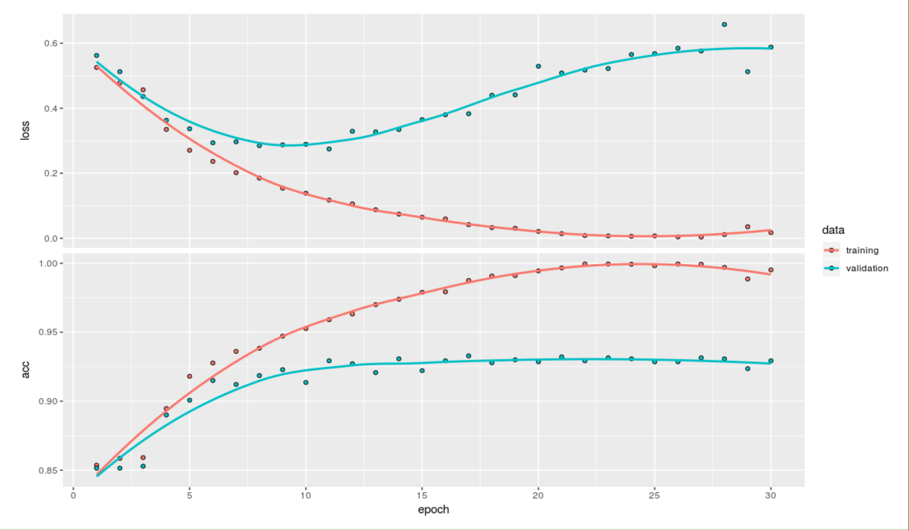

## I. INTRODUCTION   

NASA spacecraft was launched off for a mission to Venus on May 4, 1989, the mission mapped surfaces of Venus and image recorded most 98% of Venus surface. The analysis of the images revealed that there are several volcanoes on Venus. This project aims to construct prediction model to identify whether a image contains volcanoes or not. 


### Data Source Information
The data was downloaded from Kaggle, which is originally from NASA's Magellan spacecraft database. (https://www.kaggle.com/amantheroot/finding-volcanoes-on-venus/data)

### Data Description
9734 images were captured by the spacecraft and converted to pixels (110 x 110, from 0 to 255), where every image is one row of 12100 columns (all the 110 rows of 110 columns). Images can contain more than one volcanoes or maybe none.
The 9000+ images are separated to four datasets (file names : *train_images*, *train_labels*, *test_images*, and *test_labels*):

#### Image Dataset (*train_images* and *test_images*)
*Train_images* : 7000 images as train data with 12100 variables;  
*Test_images* : 2734 images as test data with 12100 variables; 
All the variables (V1 to V12100) correspond to the pixel image, 110 pixels * 110 pixels = 12100 pixels.

#### Label Dataset (*train_labels* and *test_labels*)
A summary of the variables in both *train_labels* and *test_label* datasets is listed down below:   
1. *Volcano?* : If in the image there exists at least one volcano, the label is 1 (Yes). Otherwise, the label is 0 (No). 
(If Volcano? equals 0, the following three categories would be "NaN").
2. *Type* : 1 = definitely a volcano,2 = probably, 3 = possibly, 4 = only a pit is visible   
3. *Radius* : Is the radius of the volcano in the center of the image, in pixels?   
4. *Number Volcanoes* : The number of volcanoes in the image.  

### Literature Review
In Kaggle, there were 11 kernels regarding data analysis of this dataset, all using Python. The kernels included vivid data visualization and exploratory data. Most kernels focused on classification prediction on whether there are volcanoes or not. For this classification prediction, different methods have been used to construct prediction model, from simple models such as logistic regression, to advanced models such as Convolutional Neural Network (CNN) and VGG Neural Network for deep learning. Accuracy of models ranged from 84.1% to 97%.

### Scientific Goal
For this project, we focus mainly on doing classification predition on whether each image has a volcano or not. In addition, if the classification prediction goes well, we will also construct models to predict the number of volcanoes in the images. We aim in constructing different classification models and choosing the best model to predict whether there exists a valcano in each image. Identifying valcanoe through IT technology would increase the efficency of space exploration and safty of the crews. 

## II. EXPLORATORY DATA

```{r include=FALSE}
#################
# load datasets #
#################
load("test_data.RData")
load("train_data.Rdata")
train_y <- read.csv("train_labels.csv", header = TRUE)
test_y <- read.csv("test_labels.csv", header = TRUE)
```

The first 6 observations of *train_labels*
```{r head_train_y, echo=FALSE}
head(train_y)
```
\newpage
The first 6 observations of *test_labels*
```{r head_test_y, echo=FALSE}
head(test_y)
```

After exploring the datasets, we found only labels have NaNs. We have set the those values to 0, an insignicant value in our dataset. 

### Data Visualization

6 observations are picked to demonstrate how the images got labeled. Figure 1 - 4 show how well the volcanoes can be seen from the images (*Type* : 1 = definitely a volcano,2 = probably, 3 = possibly, 4 = only a pit is visible). Figure 5 contains 2 volcanoes, and Figure 6 contains no volcano at all. We can tell from the images that a bright white dot indicates a potential volcano, while the white dot might not be clear enough to see in the image, which means that it is hard to identify whether there is a volcano or not.

```{r volplot_function, echo=FALSE, fig.height=5, fig.width=5}
volplot <- function(data, obs){
  im <- as.numeric(data[obs,])
  m <- matrix(im, nrow = 110, byrow = TRUE)
  image(m, col = grey((0:255)/255))
}
```

```{r, echo=FALSE, fig.height=2.5, fig.width=2.5, fig.cap="Obs 10 Type: 1 Radius: 22.02 Number Volcanoes: 1", fig.pos='H'}
volplot(train_data, 10)
```

```{r, echo=FALSE, fig.height=2.5, fig.width=2.5, fig.cap="Obs 39 Type: 2 Radius: 19.31 Number Volcanoes: 1", fig.pos='H'}
volplot(train_data, 39)
```

```{r, echo=FALSE, fig.height=2.5, fig.width=2.5, fig.cap="Obs 1 Type: 3 Radius: 17.46 Number of Volcanoes: 1", fig.pos='H'}
volplot(train_data, 1)
```

```{r, echo=FALSE, fig.height=2.5, fig.width=2.5, fig.cap="Obs 30 Type: 4 Radius: 6.40 Number Volcanoes: 1", fig.pos='H'}
volplot(train_data, 30)
```

```{r, echo=FALSE, fig.height=2.5, fig.width=2.5, fig.cap="Obs 289 Type: 1 Radius: 11.05 Number Volcanoes: 2", fig.pos='H'}
volplot(train_data, 289)
```

```{r, echo=FALSE, fig.height=2.5, fig.width=2.5, fig.cap="Obs 2 No Volcano", fig.pos='H'}
volplot(train_data, 2)
```

### Data Summary

To facilitate the analysis process and explore the data, we have summarized the data. The `ggplot` has been used to visualize the training set labels. Figure 7 shows that only 1000 images in the training dataset have volcanoes. Figure 8 shows that within 1000 images that have volcanoes, how clearly we can identify the volcanoes. 
```{r echo=FALSE, message=FALSE, warning=FALSE, fig.height=3, fig.width=3, fig.cap="How many images have volcanoes?"}
library(ggplot2)
train_y$Volcano. <- as.factor(train_y$Volcano.)
levels(train_y$Volcano.) <- c("No", "Yes")
ggplot(train_y, aes(x = Volcano., fill = Volcano.)) +
  geom_bar(stat='count') +
  labs(x = 'How many images have volcanoes?') +
        geom_label(stat='count',aes(label=..count..), size=2) +
        theme_grey(base_size = 8) +
        theme(legend.position="bottom")
```

```{r echo=FALSE, fig.height=3, fig.width=3, fig.cap="How clealy can we identify the volcanoes?"}
train_y$Type <- as.factor(train_y$Type)
levels(train_y$Type) <- c("definitely a volcano", "probably", "possibly", "only a pit is visible", "no volcano")
ggplot(train_y[(train_y$Type != "no volcano"),], aes(x = Type, fill = Type)) +
  geom_bar(stat='count') +
  labs(x = 'How clearly can we identify the volcanoes?') +
        geom_label(stat='count',aes(label=..count..), size=2) +
        theme_grey(base_size = 8) +
        theme(legend.position="bottom")
```

## III. METHODOLOGY

### Lasso Regression  

To apply Lasso Regression, we first selected reasonable interval for tuning parameter $\lambda$ by ploting cross-validation error, which gives us the interval (-6.5, -5). Afterthat, we did the model selection by using cv.glmnet and use the "lambda.min" as final tuning parameter, which gives us 470 selected pixels. The prediction using those 470 pixels yielded a good start, a high prediction accuracy, for our following analysis. 

### Logistic Regression

Before applying logistic regression, we applied tow variable selection methods to reduce dimension. 400 pixels were selected by using Marginal Screening and 470 pixels were selected by using above Lasso Regression. Then, we applyed logistic regression on those 400 and 470 pixels repectively. We then recorded their F1 score and AUC. 

### Neural Network  

Neural Network was used in the project for seeking better classfication results. The raw data *train_images* and *test_images* was converted into numeric variables and reshaped into 3D array with dimension 7000 $\times$ 110 $\times$ 110 and 2734 $\times$ 110 $\times$ 110 respectively. The pixels were shrinked from 0-255 to 0-1 by dividing each pixel by 255. The target label (Volcano?) was converted into categorical variable for classification. The neural network used several convolutional dense layers for classification. The neural network model yielded a satisfying classification result.

Two neural network models were run in this project. Figure 9 shows the result of the first neural network model which is designed to classify whether an image contains a volcano. The model used 20% of the training data as validation data. Figure 10 shows the result of the second neural network model which is designed to classify whether an image contains at least one volcano. The model, similar to the first one, used 20% of the training data as validation data. 

\begin{center}
\begin{tabular}{cccll}
\cline{1-3}
\multicolumn{1}{|c|}{}             & \multicolumn{1}{c|}{\textbf{No}} & \multicolumn{1}{c|}{\textbf{Yes}} \\ \cline{1-3}
\multicolumn{1}{|c|}{\textbf{No}}  & \multicolumn{1}{c|}{2270}        & \multicolumn{1}{c|}{88}           \\ \cline{1-3}
\multicolumn{1}{|c|}{\textbf{Yes}} & \multicolumn{1}{c|}{30}          & \multicolumn{1}{c|}{346}          \\ \cline{1-3}
\end{tabular}
\end{center}

```{r echo=FALSE, out.width="250px", fig.cap="Neural Network to classify whether an image contains volcanoes", fig.pos='H'}
knitr::include_graphics("neural_network.png")
```

```{r echo=FALSE, out.width="250px", fig.cap="Neural Network to classify how many volcanoes in each image", fig.pos='H'}

```

```{r eval=FALSE, include=FALSE}
library(MLmetrics)
library(pROC)
load("neural_network.RData")
table(pred_results_class, test_y$Volcano.)
F1_Score(y_true = test_y[,1], y_pred = pred_results_class, positive = NULL)
auc(test_y[,1], pred_results[,2])
```

### Variable selection methods

#### Shrinking method (Lasso)

By applying Lasso Regression, we were able to shrink highly correlated pixels to 0 and only had important one left. With the tuning parameter $\lambda$'s interval we selected by examing the cv plot, we selected 470 important pixels and apply those to lasso and logistic regression respectively.

#### Marginal Screening

To apply Marginal Screening, we use for loop to model each pixels with outcome by using glm function, logistic regression. After sorting the p values from smallest to largest, we selected the top 400 pixels. The reason why we select top 400 pixels is that, affter trying different number of top pixels, we found 400 pixels gave us highest prediction error. 

#### Variable selection methods comparison

We originally only applied Marginal Screening to logistic regression. But after realizing Lasso helped us selected variables as well, we tried both methods on logistic regression.

By looking at the pixels' index, we found that the pixels selected by Marginal Screening focused between 4000-7000, which corresponds to the center of pictures; while pixels selected by lasso regression were more spread. 

By applying those two different selection methods, we found the accuracy of Lasso selection is higher. Therefore, we may conclude that lasso' more spread pixels made more sense because Marginal Screening's centered selection might ignore some important pixels at the edges. 

## IV. RESULT & CONCLUSION


Using 


\begin{center}
Table : Test dataset prediction result
\end{center}

\begin{center}
\begin{tabular}{cccll}
\cline{1-3}
\multicolumn{1}{|c|}{\textbf{Model}} & \multicolumn{1}{c|}{\textbf{AUC}} & \multicolumn{1}{c|}{\textbf{F1 Score}} \\ 
\cline{1-3}
\multicolumn{1}{|c|}{\textbf{Neural Network}}  & \multicolumn{1}{c|}{0.9629} & \multicolumn{1}{c|}{0.9747}\\ 
\cline{1-3}
\multicolumn{1}{|c|}{\textbf{xgboost}} & \multicolumn{1}{c|}{0.9680} & \multicolumn{1}{c|}{0.9628} \\ 
\cline{1-3}
\multicolumn{1}{|c|}{\textbf{Lasso}} & \multicolumn{1}{c|}{0.9347} & \multicolumn{1}{c|}{0.9574} \\ 
\cline{1-3}
\multicolumn{1}{|c|}{\textbf{Logistic (Marginal Screening)}} & \multicolumn{1}{c|}{0.8429} & \multicolumn{1}{c|}{0.9386} \\ 
\cline{1-3}
\multicolumn{1}{|c|}{\textbf{Logistic (Lasso Selection)}} & \multicolumn{1}{c|}{0.8672} & \multicolumn{1}{c|}{0.9527} \\ 
\cline{1-3}
\end{tabular}
\end{center}

## V. APPENDIX
```{r eval=FALSE, include=TRUE}
## number_volcano
train_y_number <- to_categorical(train_y$Number.Volcanoes, num_classes = 6)
test_y_number <- to_categorical(test_y$Number.Volcanoes, num_classes = 6)

model <- keras_model_sequential() %>%
  layer_conv_2d(filters = 8, kernel_size = c(3, 3), activation = "relu", input_shape = c(110, 110, 1)) %>%
  layer_max_pooling_2d(pool_size = c(2, 2)) %>%
  # layer_dropout(rate = 0.2) %>%
  layer_conv_2d(filters = 16, kernel_size = c(3, 3), activation = "relu") %>%
  layer_max_pooling_2d(pool_size = c(2, 2)) %>%
  # layer_dropout(rate = 0.3) %>% 
  layer_conv_2d(filters = 16, kernel_size = c(3, 3), activation = "relu") %>%
  layer_flatten() %>%
  # layer_dense(units = 16, activation = "relu") %>%
  layer_dense(units = 6, activation = "softmax")

model %>% compile(
  optimizer = "adam",
  loss = "categorical_crossentropy",
  metrics = c("accuracy")
)

model_ret <- model %>% fit(
  train_images, train_y_number,
  epochs = 30, batch_size=32,
  validation_split = 0.2
)
plot(model_ret)

model %>% save_model_hdf5("my_neural_network_model_number.h5")
results <- model %>% evaluate(test_images, test_y_number)
results
# pred_results_number_class <- model %>% predict_classes(test_images)

# new_model <- load_model_hdf5("my_neural_network_model.h5")
# new_model %>% summary()
pred_results_number <- model %>% predict(test_images)
pred_results_number_class <- model %>% predict_classes(test_images)
acc_loss_number <- model %>% evaluate(test_images, test_y_number)
acc_loss_number
save(pred_results_number, pred_results_number_class, acc_loss_number, file="neural_network_number.RData")
# model %>% save_model_hdf5("my_neural_network_model.h5")
```